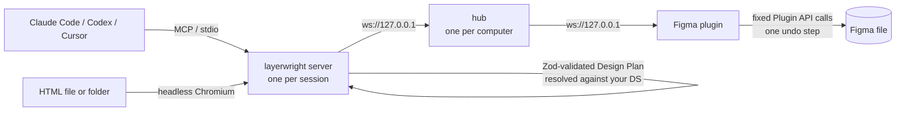

# Layerwright

**Turn Claude Design and Claude Code designs into native, editable Figma files, and Figma designs into code that uses your own components.**

[](https://github.com/shayan-m81/layerwright/actions/workflows/ci.yml)
[](https://www.npmjs.com/package/layerwright)
[](https://github.com/shayan-m81/layerwright/blob/main/LICENSE)


<sub>Select a desktop screen in Figma, press **Mobile** in the Layerwright window and send it to a Claude Code session. The session builds 390 px mobile versions of two right-to-left Persian screens with Auto Layout, its cursor showing where it works. The window lists the connected sessions and each request's answer. (2× speed.)</sub>

```bash
npx layerwright init   # in your project, then open the plugin in Figma desktop (see Quickstart)
```

Layerwright is an open-source MCP server and Figma plugin for Claude Code, Codex and Cursor. It imports
HTML, such as a Claude Design "standalone HTML" export, into Figma as real frames with Auto Layout,
text, images and vector icons. It builds new screens from your own Design System: real component
instances, variables and text styles. And it works the other way: select a Figma frame and Claude
implements it in your codebase with your existing components and tokens, then checks that it did.

## Why

Claude Design exports to HTML, PDF, PPTX and Canva, but not to Figma. Claude Code can write UI code,
but it has no native way to put a design into a Figma file your team can edit. Most "HTML to Figma"
tools either paste a flat picture or need a cloud account.

Layerwright closes that gap locally:

- **Claude Design to Figma:** export standalone HTML, run one command, and you get editable Figma frames.
- **Claude Code to Figma:** ask Claude for a screen or a flow, and it is built from your Design System's components.
- **Figma to code:** select a frame, and Claude implements it with the React components you already have (not a new copy of each button), mapped once and shared with your team.
- **Ask from Figma:** select layers, press *Mobile version* or *Build in code* in the plugin window, and a session starts on it.
- **No API keys, no cloud, no account.** Everything runs on your machine. The plugin only talks to `localhost`.

## Features

### Bring designs into Figma

- **HTML to Figma import** (`import_html_to_plan`)
  - Flexbox becomes Auto Layout: direction, gap, padding, alignment and wrap. Fixed CSS sizes stay fixed.
  - Colours, borders, radii, shadows, gradients, fonts, line height and letter spacing come across.
  - Text with inline `<b>`, `<span>` and `<a>` is one text layer with styled ranges.
  - Images and inline SVG icons are imported as real images and vectors.
  - Desktop (1440) and mobile (390) screens are rendered side by side.
  - RTL is supported (Persian, Arabic, Hebrew). Rows keep their visual order and text stays right-aligned.
- **Pixel-faithful mode** (`figma_import_html`) for review boards and art-heavy pages: exact layers, variant sets built from states, and instance swaps.
- **AI design to Figma from a prompt.** Claude writes a typed Design Plan (a JSON DSL). The plan is validated and resolved against your components, variables and text styles, then built deterministically. Claude never writes Figma plugin code.
- **Prototypes.** Click, hover and timed interactions, navigate / overlay / swap / back, smart animate and push transitions, scrolling frames and flow starting points, in plans or on existing frames.
- **No AI needed for a plain import.** `npx layerwright import ./design.html --to-figma` builds it in the open Figma file.
- **Fonts from exports:** `npx layerwright fonts ./export --install` installs the TTF/OTF fonts a design ships.

### Use your Design System

- **Design System automation.** After a Design System scan, buttons, inputs and links become your real Figma components when they clearly match, and you can map any element yourself (`mappings: [{ selector, component }]`).
- **Design System sync.** After an import, `figma_analyze_design({ mode: "sync" })` swaps buttons and pills for your DS components (the variant that looks closest), gives text your text styles by size and weight, and binds colours to your variables and styles. You approve it; originals are kept hidden.
- **Audit and fix existing frames.** Hard-coded colours become variables, raw text gets text styles, and custom buttons become component instances, in groups you can pick. Originals are hidden, never deleted.
- **Work on existing designs** (`figma_edit`). Rename, move, duplicate, delete, and turn existing frames into components or variant sets with text properties, in one undo step.
- **Figma back to a plan.** Any subtree exports as an editable Design Plan to clone, refactor or implement in code: layout, tokens, text styles, instances, gradients, shadows, blurs, shapes, and vectors or boolean shapes as SVG icons.

### Figma to code

`figma_inspect` → `code_scan_components` → `code_mapping` → `code_verify_usage`

- Reads the frame as a plan: layout, spacing and colour tokens, text styles, and every component instance with its variant and properties.
- Scans your React / Next.js codebase for exported components (and Tailwind or shadcn/ui) and suggests which code component each Figma component is.
- The mappings you confirm are saved in `.layerwright/mapping.json`; commit it and the whole team reuses them.
- Claude implements the frame with the mapped components and your theme tokens; `code_verify_usage` then flags design components that weren't used, raw `<button>` / `<input>` duplicates, and arbitrary Tailwind values.

### Work together with your agents

- **Several sessions, one Figma.** Every Claude Code, Codex and Cursor session on your computer shares one connection to the plugin, with no port to configure. The plugin window shows who is connected and what each is doing (sessions name themselves after their task). Your selection goes to the session you give it to, and a session never overwrites a layer another one just changed.
- **Ask from Figma.** Select layers in the plugin window, pick a session and send a request: *Build in code*, *Polish design*, *Make component*, *Mobile version*, or your own words. A Claude Code session with the plugin starts on it by itself (the plugin's monitor wakes the session); Codex gets it on its next Figma step or with `/layer:inbox`. Progress and the session's answer come back to the window.
- **Notes on the canvas.** Type a text layer that starts with `@<session>` (or `@claude` when one session is connected) on the frame it's about, and that session gets it like a request from the window. Only notes you type count: edits by collaborators and text Layerwright writes never start a task.
- **AI cursor.** While a session changes the canvas, a cursor in its colour with its name shows where it works, like a collaborator's. It exists only during that change and is gone before the change's undo step closes, so undo never brings it back. Waiting and questions show in the plugin window instead (Settings → AI cursor to turn it off).
- **`/layer:` commands in Claude Code and Codex.** `init` installs the Layerwright plugin for the agents it finds (it asks; Claude Code by default): `/layer:help`, `/layer:connect`, `/layer:import`, `/layer:design`, `/layer:edit`, `/layer:code`, `/layer:check`, `/layer:components`, `/layer:prototype`, `/layer:shot`, `/layer:inbox`, `/layer:doctor`, `/layer:report`.

### Check, learn and stay safe

- **You see what was built.** `figma_export_image` renders any node, and compares it with the source HTML (or another node) with a diff heatmap. `save: true` writes the PNG to `.layerwright/exports/` so the agent can show it to you (`/layer:shot`).
- **Accessibility and critique.** WCAG contrast (on the real background), touch-target and text-size checks, plus consistency signals; Claude uses them with a picture in a critique loop to polish what it builds.
- **Safe by default.**
  - Every run is one undo step, and a failed run rolls back completely.
  - Results are checked against the plan: structure, sizes, variants, text overrides and prototype links.
  - Existing nodes change only after you approve; deleting without approval only hides and labels a layer.
  - Everything Layerwright creates is tagged, so `figma_cleanup` can list and remove a session's leftovers.
  - Only your paired plugin window and your own sessions can use the local connection: web pages in your browser can't.
- **Learns per project.** Font substitutions, mappings and component choices are reused next time, your corrections are kept as notes, and recurring problems come with a hint (`.layerwright/memory.json`, shareable). `npx layerwright report` drafts a redacted issue from them for you to send.
- **Tells you about updates** in the plugin window, in Claude and in `doctor`.

## Quickstart (3 steps)

Requirements: Node.js 20+, Figma desktop, Claude Code or Codex (or Cursor: `npx layerwright init --cursor`).

```bash
# 1. In your project folder
npx layerwright init
```
`init` asks which agents get the Layerwright plugin (the ones it finds are preselected; `--agents claude,codex` or `--no-agents` skip the question), installs it with their own `claude plugin` / `codex plugin` commands, and pairs the Figma plugin with this computer.

2. In **Figma desktop**, go to **Plugins → Development → Import plugin from manifest…**. The plugin sits in a hidden folder (`~/.layerwright/figma-plugin/manifest.json`), so `init` copies that path to your clipboard and shows the folder: in the file dialog press **⌘⇧G** (Windows: click the File name box), paste, Enter. You do this once; afterwards run **Plugins → Development → Layerwright** and keep its small window open. `npx layerwright plugin` shows these steps again.
3. Start a new **Claude Code** or **Codex** session, type `/layer:help`, or ask:
   - *"Import ./design.html into Figma"*: a Claude Design HTML export becomes editable frames.
   - *"Create a sign-up flow in Figma using our Design System"*: new screens built from your components.
   - Select a frame in Figma, then *"Implement the selected Figma frame in code using our components"*: Figma → code with your mapped React components and theme tokens, checked afterwards.

Requests from the Figma window wake a Claude Code session by themselves: the plugin runs a monitor (`layerwright inbox-watch`) whose notifications reach the session. `npx layerwright claude` also turns on Claude Code channels (a research preview; Team and Enterprise organizations must enable them first). In Codex a request waits for the session's next Figma step or `/layer:inbox`.

Install from GitHub instead: `claude plugin marketplace add shayan-m81/layerwright` then `claude plugin install layer@layerwright`; for Codex, `codex plugin marketplace add shayan-m81/layerwright` then `codex plugin add layer@layerwright`. `npx layerwright agents` refreshes the plugin after an update.

Another MCP client (Claude Desktop, VS Code, Windsurf)? Add the same `layerwright` server to its MCP config and start from its prompts: `figma_design` (the whole guide), `html_to_figma`, `build_in_figma`, `change_figma` or `figma_to_code`. They are built from the same skill, so every client follows the same workflow.

Want these rules always in Claude's context? Paste [this prompt](https://github.com/shayan-m81/layerwright/blob/main/docs/claude-prompt.md) into your project's `CLAUDE.md`.

Something not working? Run `npx layerwright doctor`.

For HTML import, Layerwright needs a Chromium. It uses Google Chrome if you have it installed. Otherwise run `npx playwright install chromium`.

Want to try the conversion without Figma? `npx layerwright import ./design.html` prints what would be built.
Want it in Figma without Claude? Run the plugin, then `npx layerwright import ./design.html --to-figma --page "Designs"`
(`--faithful` for exact layers, `--scan` to use your Design System's components).

## How it works



1. **Plan.** Claude, or the HTML importer, produces a **Design Plan**: a small, typed JSON DSL of screens, frames, text, components, tokens and images.
2. **Validate and resolve.** The server checks the plan with Zod. It then resolves every component, variant, property, variable and text style against a cached scan of *your* Figma file. Unknown names come back as errors with suggestions and never reach Figma.
3. **Execute.** The plugin builds the resolved plan with fixed Plugin API calls. There is no `eval` and no model-written code.
4. **Verify.** The result is re-inspected and compared with the plan and, for HTML imports, with the page's rendered boxes. `figma_export_image` shows the result next to the source.

Every session reaches Figma through one small local process, the **hub**. The first session starts it, and it stops by itself a minute after the last session leaves. It routes each request to the plugin and the answer back to the session that asked, so several agents can work in one file.

Read more in [docs/architecture.md](https://github.com/shayan-m81/layerwright/blob/main/docs/architecture.md). The DSL is documented in [docs/dsl.md](https://github.com/shayan-m81/layerwright/blob/main/docs/dsl.md).

## MCP tools

| Tool | What it does |
|---|---|
| `import_html_to_plan` | HTML file or folder → editable Design Plan (Auto Layout, DS components, your own mappings). Returns a `planId` |
| `figma_execute_plan` | Builds a plan in Figma: one undo step, rollback on failure, automatic verification |
| `figma_preview_plan` | Validates and resolves a hand-written plan and returns a summary |
| `figma_edit` | Rename, move, duplicate, set, delete, resize to fit, group / ungroup, boolean shapes, componentize (variants, text properties), swap instances, bind variables, apply styles, annotations, prototype links and flows |
| `figma_export_image` | A node as an image; compared with the source HTML or another node, with a diff heatmap. `save: true` writes it to `.layerwright/exports/` to show the user |
| `figma_inbox` / `figma_reply` | Requests the user sent from the Figma window to this session, and the answer shown back in the window |
| `figma_status` / `figma_scan_design_system` / `figma_get_design_context` | Connection and page, Design System scan (components, variants, variables, styles, duplicate names), task-scoped context |
| `figma_inspect` / `figma_verify` / `figma_select` | Snapshots (tree, summary, text, instances, or the subtree as a plan), plan-vs-canvas checks, select and zoom (switches page) |
| `figma_analyze_design` / `figma_apply_transformations` | Audit a frame against the DS, or `mode: "sync"` after an import; apply the groups you approve |
| `figma_import_html` / `figma_pages` / `figma_foundations` | Pixel-faithful import, page setup, variables and text styles |
| `figma_migrate` | Move every instance of one component set to another, variant by variant, keeping overrides (dry run first) |
| `figma_cleanup` | List (and with approval remove) what Layerwright made in this session |
| `layerwright_memory` | What the project remembers (fonts, mappings, component choices, notes, recurring problems); add notes or forget entries |
| `code_scan_components` / `code_mapping` / `code_verify_usage` | Figma to code: find your code components, map them to Figma components, check the implementation uses them |

## FAQ

**Is this an official Anthropic or Figma product?**
No. It is an independent open-source project that works with Claude Code and Figma.

**Does it need an API key, an account or a server?**
No. Claude Code runs the MCP server locally, and the Figma plugin connects to it on `localhost`. Nothing is uploaded.

**Can I use it without Claude Code?**
Yes. `npx layerwright import ./design.html --to-figma` builds an HTML file in Figma with no AI at all, and any MCP client can call the tools. The skill and the design workflows (building from a prompt, componentizing, prototyping) are written for Claude Code.

**Can it make prototypes?**
Yes. Plans and `figma_edit` set click, hover, press, drag and timed interactions (navigate, overlay, swap, scroll to, change to, back, close, open URL) with transitions, scrolling frames and flow starting points. Overlays open centred: the Plugin API can't set their position.

**Does it work with the official Figma MCP?**
It doesn't need it. If it's connected, Claude can use its library search to find a component your file doesn't use yet and pass its key to Layerwright.

**Does the output use Auto Layout?**
Yes, where the HTML uses flexbox or evenly spaced stacks. Grid and overlapping layers become frames with absolutely positioned children, so the result still looks right.

**Will it use my Design System?**
Yes. Scan the file that has your components (`figma_scan_design_system`), and imported buttons, inputs and links become instances of them. Anything that doesn't match stays a styled frame.

**Does it work with right-to-left languages?**
Yes. Direction, text alignment and row order are preserved. Fonts such as Vazirmatn are matched to their real style names.

**Can a web page or another app talk to it?**
No. The hub listens on `127.0.0.1` only and refuses browser connections. Sessions need the per-computer key that `init` creates (`~/.layerwright/key`), and only the plugin window paired with that key can send requests into your sessions. Canvas notes count only when you type them, not when a collaborator does.

**Does it work in the Figma browser app?**
Development plugins need Figma desktop.

## Troubleshooting

Start with `npx layerwright doctor`. It checks Node, `.mcp.json`, the skill, the plugin files, the running server, the plugin connection and Chromium, and it prints a fix for each problem. More cases are covered in [docs/troubleshooting.md](https://github.com/shayan-m81/layerwright/blob/main/docs/troubleshooting.md).

## Limitations

- CSS grid, floats and transforms are imported as positioned layers, not as Auto Layout.
- Linear, radial and conic gradients and `blur()`/`backdrop-filter: blur()` come across; other filters and blend modes are dropped in plan mode (the pixel-faithful mode keeps blend modes). Only the top background layer is used.
- The largest corner radius is used when the four corners differ.
- The plan export leaves image fills out (they need the original file) and keeps one colour plus the top gradient when a layer stacks several fills.
- Fonts must be installed on the machine that runs Figma. A missing family falls back to Inter, with a warning.
- Images must be PNG, JPEG or GIF (a Figma limit), up to 10 MB each.
- The scan finds library components only when an instance of them exists in the open file. Others can be used by key (e.g. found with the official Figma MCP's library search).
- Prototype overlays open centred (their position can't be set through the Plugin API). Plans can't hide instance layers by override yet.
- One Figma window is connected at a time: every session on your computer shares it through the hub. Sessions from an older Layerwright are asked to update before they can join.
- AI cursors are real, locked layers while a change runs (Figma has no API for overlays), so collaborators in the file see them briefly. They are removed before the change's undo step closes.

## Roadmap

- Per-corner radii, CSS grid → Auto Layout wrap
- Design tokens export (W3C format) and import
- Figma Community listing ([plan](https://github.com/shayan-m81/layerwright/blob/main/docs/figma-community-plan.md))
- Instance-swap properties and hidden-layer overrides in plans

## Contributing

Issues and pull requests are welcome. See [CONTRIBUTING.md](https://github.com/shayan-m81/layerwright/blob/main/CONTRIBUTING.md). To develop from a clone:

```bash
git clone https://github.com/shayan-m81/layerwright && cd layerwright
npm install && npm run build && npm test
npx tsx apps/mcp-server/src/cli.ts init   # wires this checkout into the current folder
```

## License

[MIT](https://github.com/shayan-m81/layerwright/blob/main/LICENSE) © Shayan Montazeri

---

*Keywords: claude design to figma, export claude design, claude code figma, html to figma, figma mcp, ai design to figma, design system automation.*

Not affiliated with, endorsed or sponsored by Anthropic or Figma. Claude is a trademark of Anthropic; Figma is a trademark of Figma, Inc.
